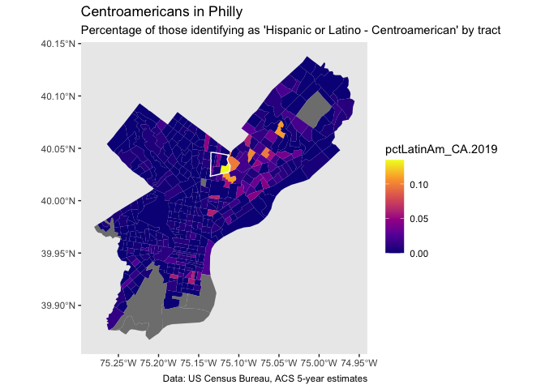

Lab\_2\_assignment\_AdrianLeon
================
Matt Harris + Adrián León
16/8/2021

## Load libraries

``` r
library(tidyverse)
library(tidycensus)
library(sf)
library(tmap) # mapping, install if you don't have it
set.seed(717)
```

## Load data from {tidycensus}

``` r
acs_vars <- c("B01001_001", # ACS total Pop estimate
              "B25002_001", # Estimate of total housing units
              "B25003_002", # House-ownership
              "B03001_003", # People self-described as Hispanic or Latino
              "B03001_008") # People self-described as centroamerican
              
myTracts <- c("42101027300",
              "42101027401",
              "42101027402",
              "42101027500",
              "42101028500",
              "42101028600",
              "42101029000")

acsTractsPHL.2019.sf <- get_acs(geography = "tract",
                            year = 2019,
                             variables = acs_vars,
                             geometry = TRUE,
                             state  = "PA",
                             county = "Philadelphia",
                             output = "wide") %>%
  dplyr::select (GEOID, NAME, all_of(paste0(acs_vars,"E"))) %>%
  rename (total_pop.2019 = B01001_001E,
          total_HU.2019 = B25002_001E,
          total_HOwners.2019 = B25003_002E,
          total_LatinAm.2019 = B03001_003E,
          total_LatinAm_CA.2019 = B03001_008E) %>%
  mutate(pctLatinAm_CA.2019 = total_LatinAm_CA.2019/total_pop.2019) %>%
  mutate(Neighborhood = ifelse(GEOID %in% myTracts,
                               "OLNEY",
                               "REST OF PHILADELPHIA"))
```

## Transform to WGS84 with {sf}

``` r
acsTractsPHL.2019.sf <- acsTractsPHL.2019.sf %>% 
  st_transform(crs = "EPSG:4326")
```

## Plot with {ggplot2}

<!-- -->
